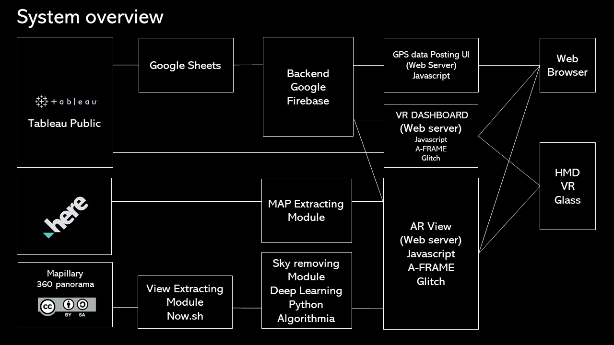
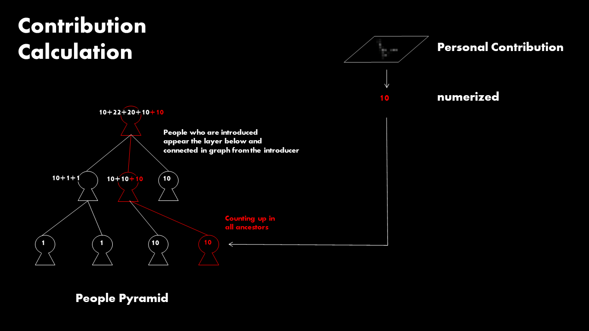

# STANDY 2019

1. PDF

    - 10-Olympics-STANDY-20190805.pdf

2. Video

    - https://standy2019.glitch.me/

2. GPS data Posting UI

    - [demo (link)](https://standy.firebaseapp.com/)
    - code  
       - main: standy-react-frontend  
        - user management: standy-user-management
        - SERVERLESS FUNCTION: matrix calculator for database: standy-cloudfunction-matrix-generator
        - SERVERLESS FUNCTION: user contribution calculator: standy-user-contribution-calculator

3. 3D Dashboard

   (Regular mode)

   - [demo (link)](bit.ly/Save_the_Olympics)

   - [code (link)](https://glitch.com/edit/#!/vr-dashboard-olympics?path=index.html:1:0)

   (AR mode)

   - [demo (link)](https://ar-dashboard-olympics.glitch.me) 

      must be opened with WebXR viewer

   - [code (link)](https://glitch.com/edit/#!/ar-dashboard-olympics)

4. Street View
 
   - [demo (link)](http://ar-view.glitch.me)

   - [code (link)](https://glitch.com/edit/#!/ar-view?path=index.html:1:0)

4. Crowdedness data visualization

    - [demo (link)](https://public.tableau.com/profile/koichi.okada#!/vizhome/shared/X7Q4288G8)
    - tableau workbook: Dismissing-the-crowdedness-challenge-20190724.twbx
