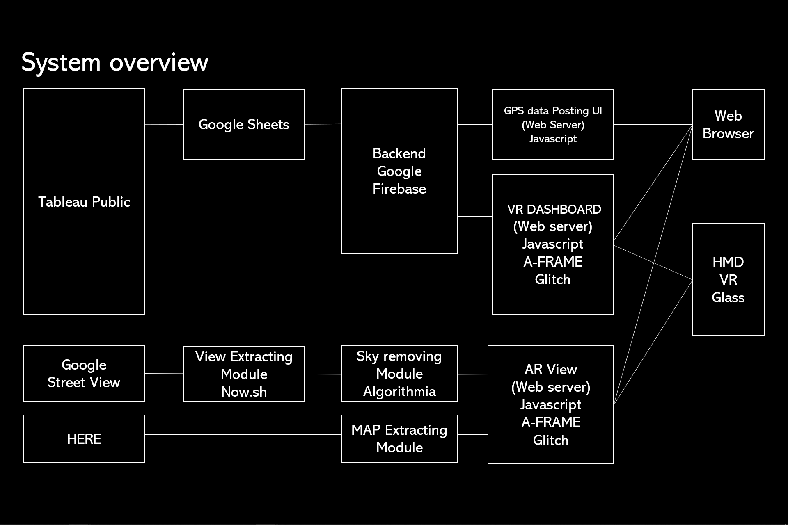

# STANDY 2019

1. GPS data Posting UI

   - UI: - main: standy-react-frontend - user management: standy-user-management
   - SERVERLESS FUNCTION: matrix calculator for database: standy-cloudfunction-matrix-generator
   - SERVERLESS FUNCTION: user contribution calculator: standy-user-contribution-calculator

2. VR Dashboard

   - https://glitch.com/edit/#!/vr-dashboard-olympics?path=index.html:1:0

3. AR View

   - https://glitch.com/edit/#!/ar-view?path=index.html:1:0

4. Crowdedness data visualization
   - Dismissing-the-crowdedness-challenge-20190724.twbx
